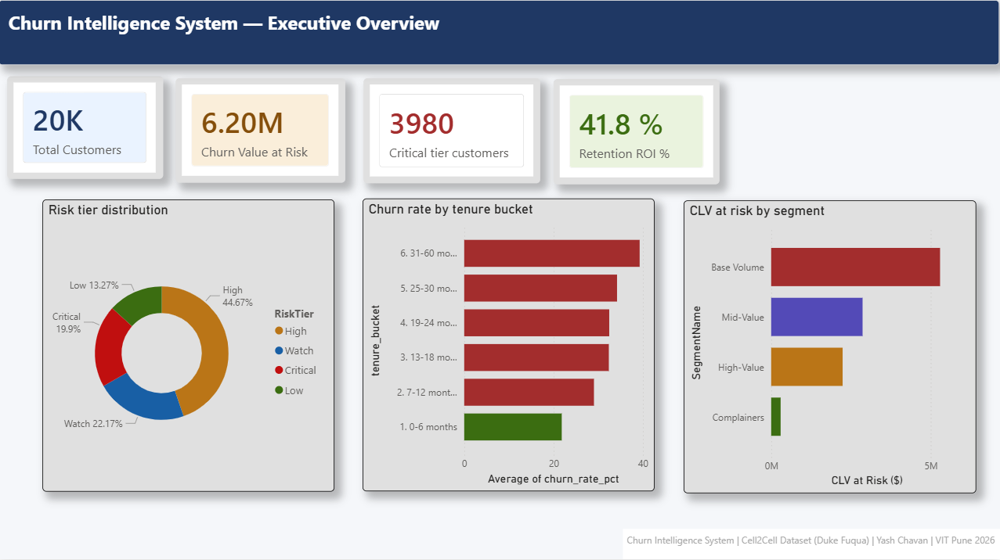
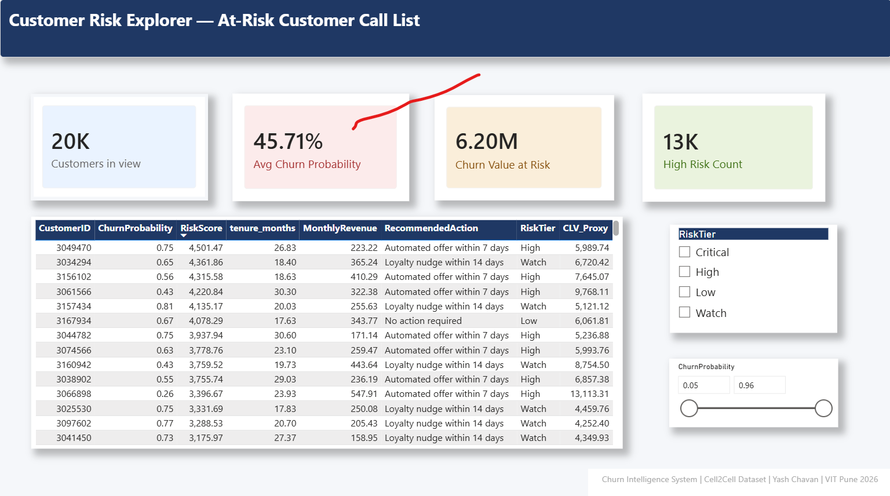
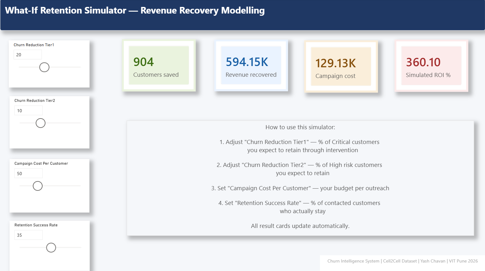
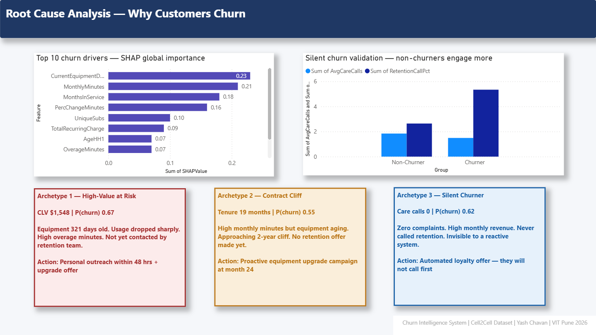

# Churn Intelligence System

**Reducing Revenue Leakage for a Mid-Size Telecom Operator**

[](https://churn-intelligence-yash.streamlit.app)
[](https://www.python.org/)
[](https://www.docker.com/)

Identified **$10.7M in realized CLV loss** and **$6.2M in at-risk ARR** across 71,000 telecom subscribers, delivering a deployable churn prediction system with a **1.66x targeting lift** over random campaigns and a 4-page executive Power BI dashboard for retention prioritization.

**[Try the Live App →](https://churn-intelligence-yash.streamlit.app)**

---

## Screenshots

### Live Churn Risk Scorer (Streamlit + Docker)
> Real-time scoring with explainable risk factors and recommended actions

### Power BI Executive Dashboard — Page 1: Executive Overview


### Power BI Executive Dashboard — Page 2: Customer Risk Explorer


### Power BI Executive Dashboard — Page 3: What-If Retention Simulator


### Power BI Executive Dashboard — Page 4: Root Cause Analysis (SHAP)


---

## Quick Start

### Option 1 — Use the Live App
**[https://churn-intelligence-yash.streamlit.app](https://churn-intelligence-yash.streamlit.app)**

### Option 2 — Run Locally with Docker
```bash
git clone https://github.com/yashtc2239-ops/cell2cell-churn-intelligence.git
cd cell2cell-churn-intelligence
docker build -t churn-intelligence .
docker run -p 8501:8501 churn-intelligence
```
Open `http://localhost:8501`

### Option 3 — Run Locally with Python
```bash
pip install -r requirements.txt
cd app
streamlit run streamlit_app.py
```

---

## Architecture

Raw Data (Cell2Cell, 71K subscribers)

|

Data Audit & Feature Engineering (Pandas)

|

SQL Analysis Layer (SQLite, 8 business queries)

|

Statistical Hypothesis Testing (Chi-Square, Mann-Whitney U, Kaplan-Meier)

|

ML Modeling (Logistic Regression -> Random Forest -> XGBoost Champion)

|

SHAP Explainability + Cost-Sensitive Threshold Optimization

|

Power BI Executive Dashboard (4 pages, DAX What-If Simulator)

|

Streamlit Web App (Dockerized, Live Scoring) <- You are here

---

## Key Findings

| Finding | Detail |
|---|---|
| **Tenure-driven churn** | Churn rises monotonically with tenure — 21.8% at 0–6 months to 39.3% at 30–60 months, contradicting the standard onboarding-risk assumption |
| **Silent churn phenomenon** | Non-churners contact customer care *more* than churners (1.84 vs 1.49 avg calls) — confirmed independently via SQL and ML |
| **XGBoost champion model** | ROC-AUC 0.673, delivering 1.66x lift over random targeting at 20% campaign capacity |
| **$10.7M realized CLV loss** | Validated through direct SQL aggregation on real subscriber data |
| **High-value segment risk** | Segment 2 (High-Value Heavy Users) carries $2.24M at risk despite being only 8% of the customer base |

---

## Tech Stack

| Layer | Tools |
|---|---|
| Data Processing | Python, Pandas, NumPy |
| Statistical Analysis | SciPy, Lifelines (Kaplan-Meier survival analysis) |
| Database | SQLite (8-query business analysis layer with window functions) |
| Machine Learning | Scikit-learn, XGBoost, SHAP |
| Visualization | Power BI (DAX measures, What-If Parameters) |
| Deployment | Streamlit, Docker, Streamlit Community Cloud |

---

## Project Structure

cell2cell-churn-intelligence/

├── data/

│   ├── raw/                # Source CSVs (gitignored)

│   ├── processed/          # Cleaned + engineered datasets

│   └── outputs/            # Charts, scored predictions, SQL exports

├── notebooks/

│   ├── 00_sanity_check.ipynb

│   ├── 02_data_audit.ipynb

│   ├── 02_5_sql_analysis.ipynb

│   ├── 03_eda_hypothesis_testing.ipynb

│   └── 04_modeling_pipeline.ipynb

├── models/

│   ├── best_model_v1.pkl    # Trained XGBoost champion

│   └── scaler_v1.pkl

├── dashboards/

│   ├── churn_intelligence_dashboard.pbix

│   └── dashboard_screenshots/

├── app/

│   ├── streamlit_app.py     # Live scoring web app

│   └── model_loader.py

├── docs/                    # BRD, data dictionary, insight memos

├── Dockerfile

├── requirements.txt

└── README.md

---

## Methodology Phases

1. **Business Understanding** — Formal BRD, KPI tree, cost-of-inaction analysis, 3-tier risk taxonomy
2. **Data Audit & ETL** — Missing value handling, outlier treatment (Winsorization), feature engineering (CLV Proxy, Service Density Score, Complaint Intensity Index)
3. **SQL Analysis Layer** — Aggregation, conditional bucketing, nested subqueries, window functions (`RANK() OVER PARTITION BY`)
4. **Statistical EDA** — Chi-Square, Mann-Whitney U, Kaplan-Meier survival analysis, KMeans customer segmentation
5. **Predictive Modeling** — Model comparison (LR/RF/XGBoost), cost-sensitive threshold optimization, SHAP explainability
6. **Power BI Dashboard** — 4-page interactive reporting tool with live DAX What-If simulator
7. **Deployment** — Dockerized Streamlit application, deployed to Streamlit Community Cloud

---

## Dataset

Cell2Cell Telecom Churn dataset — Duke University Fuqua School of Business case study (used in executive MBA strategy courses). 71,047 subscribers, 58 raw features.

---

## Author

**Yash Chavan**
B.Tech Computer Science & Engineering (Data Science), Vishwakarma Institute of Technology, Pune
[GitHub](https://github.com/yashtc2239-ops) · [Live App](https://churn-intelligence-yash.streamlit.app)
